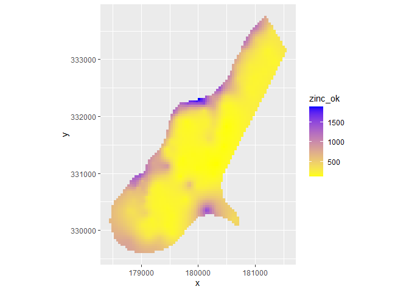
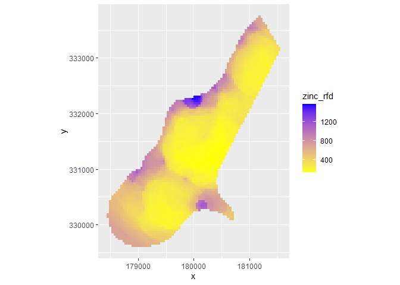

<!-- README.md is generated from README.Rmd. Please edit that file -->

# Autocorrelação Espacial e Aprendizado de máquina

*Laís de Souza Teixeira & Alan Rodrigo Panosso*

``` r
# devtools::install_github("Envirometrix/plotKML")
# devtools::install_github("Envirometrix/landmap")
library(tidyverse)
library(sp)
library(geobr)
library(skimr)
library(GSIF)
library(geoR)
library(raster)
library(ranger)
```

``` r
dados <- read_rds("data/dados_lais.rds")
skim(dados)
```

|                                                  |       |
|:-------------------------------------------------|:------|
| Name                                             | dados |
| Number of rows                                   | 2304  |
| Number of columns                                | 35    |
| \_\_\_\_\_\_\_\_\_\_\_\_\_\_\_\_\_\_\_\_\_\_\_   |       |
| Column type frequency:                           |       |
| character                                        | 7     |
| Date                                             | 3     |
| logical                                          | 2     |
| numeric                                          | 23    |
| \_\_\_\_\_\_\_\_\_\_\_\_\_\_\_\_\_\_\_\_\_\_\_\_ |       |
| Group variables                                  | None  |

Data summary

**Variable type: character**

| skim\_variable | n\_missing | complete\_rate | min | max | empty | n\_unique | whitespace |
|:---------------|-----------:|---------------:|----:|----:|------:|----------:|-----------:|
| experimento    |          0 |              1 |   8 |   8 |     0 |         1 |          0 |
| manejo         |          0 |              1 |  15 |  15 |     0 |         1 |          0 |
| tratamento     |          0 |              1 |   2 |   2 |     0 |         2 |          0 |
| cultura        |          0 |              1 |   9 |  13 |     0 |         2 |          0 |
| estado         |          0 |              1 |   2 |   2 |     0 |         1 |          0 |
| municipio      |          0 |              1 |   8 |   8 |     0 |         1 |          0 |
| prof           |          0 |              1 |   5 |   5 |     0 |         1 |          0 |

**Variable type: Date**

| skim\_variable | n\_missing | complete\_rate | min        | max        | median     | n\_unique |
|:---------------|-----------:|---------------:|:-----------|:-----------|:-----------|----------:|
| data           |          0 |              1 | 2015-10-02 | 2017-06-17 | 2017-02-09 |        21 |
| data\_preparo  |          0 |              1 | 1986-03-01 | 1986-03-01 | 1986-03-01 |         1 |
| conversao      |          0 |              1 | 1986-03-01 | 1986-03-01 | 1986-03-01 |         1 |

**Variable type: logical**

| skim\_variable     | n\_missing | complete\_rate | mean | count     |
|:-------------------|-----------:|---------------:|-----:|:----------|
| revolvimento\_solo |          0 |              1 |    0 | FAL: 2304 |
| cobertura          |          0 |              1 |    1 | TRU: 2304 |

**Variable type: numeric**

| skim\_variable  | n\_missing | complete\_rate |       mean |    sd |         p0 |        p25 |        p50 |        p75 |       p100 | hist  |
|:----------------|-----------:|---------------:|-----------:|------:|-----------:|-----------:|-----------:|-----------:|-----------:|:------|
| x               |          0 |           1.00 |      53.40 | 32.52 |       0.00 |      25.00 |      52.50 |      80.00 |     120.00 | ▆▆▇▅▃ |
| y               |          0 |           1.00 |      41.08 | 28.72 |       0.00 |      20.00 |      30.00 |      70.00 |     100.00 | ▇▆▃▃▂ |
| longitude\_muni |          0 |           1.00 |  458447.46 |  0.00 |  458447.46 |  458447.46 |  458447.46 |  458447.46 |  458447.46 | ▁▁▇▁▁ |
| latitude\_muni  |          0 |           1.00 | 7749821.85 |  0.00 | 7749821.85 | 7749821.85 | 7749821.85 | 7749821.85 | 7749821.85 | ▁▁▇▁▁ |
| ID              |          0 |           1.00 |      48.81 | 28.24 |       1.00 |      24.75 |      48.50 |      72.25 |     102.00 | ▇▇▇▇▆ |
| FCO2            |         15 |           0.99 |       4.61 |  2.25 |      -3.42 |       3.17 |       4.26 |       5.53 |      46.93 | ▇▁▁▁▁ |
| Ts              |          2 |           1.00 |      25.53 |  2.88 |      15.00 |      23.43 |      26.59 |      27.50 |      30.90 | ▁▂▂▇▃ |
| Us              |          2 |           1.00 |      13.63 |  8.06 |       1.96 |       8.00 |      11.00 |      19.00 |      44.00 | ▇▅▃▁▁ |
| pH              |          0 |           1.00 |       4.29 |  2.26 |       3.50 |       3.90 |       4.10 |       4.30 |      52.00 | ▇▁▁▁▁ |
| MO              |          0 |           1.00 |      30.59 |  5.25 |      15.00 |      27.75 |      30.00 |      34.00 |      45.00 | ▁▃▇▃▁ |
| P               |          0 |           1.00 |       5.28 |  2.44 |       1.00 |       3.00 |       5.00 |       6.00 |      17.00 | ▇▇▂▁▁ |
| K               |          0 |           1.00 |       1.93 |  1.28 |       0.60 |       1.10 |       1.60 |       2.20 |      11.50 | ▇▂▁▁▁ |
| Ca              |          0 |           1.00 |      14.68 | 13.71 |       2.00 |       6.00 |       9.00 |      19.00 |      75.00 | ▇▂▁▁▁ |
| Mg              |          0 |           1.00 |      11.80 |  5.04 |       4.00 |       8.00 |      11.00 |      15.00 |      33.00 | ▇▇▃▁▁ |
| H\_Al           |          0 |           1.00 |      68.53 | 21.22 |       0.00 |      52.00 |      72.00 |      88.00 |     121.00 | ▁▃▇▃▂ |
| SB              |          0 |           1.00 |      28.41 | 17.70 |       9.10 |      16.30 |      21.90 |      35.10 |     100.40 | ▇▃▁▁▁ |
| CTC             |          0 |           1.00 |      96.94 | 17.90 |      13.60 |      87.90 |      98.50 |     107.70 |     137.60 | ▁▁▃▇▂ |
| V               |          0 |           1.00 |      29.76 | 16.85 |       9.00 |      17.00 |      25.00 |      40.00 |     100.00 | ▇▃▂▁▁ |
| Ds              |       1149 |           0.50 |       1.30 |  0.16 |       0.95 |       1.19 |       1.29 |       1.42 |       1.60 | ▂▅▇▆▅ |
| Macro           |       1149 |           0.50 |       1.36 |  3.62 |       0.03 |       0.08 |       0.10 |       0.13 |      16.50 | ▇▁▁▁▁ |
| Micro           |       1149 |           0.50 |       5.11 | 13.14 |       0.18 |       0.31 |       0.34 |       0.38 |      45.66 | ▇▁▁▁▁ |
| VTP             |       1149 |           0.50 |      44.71 |  6.69 |      23.92 |      39.96 |      43.78 |      48.41 |      63.69 | ▁▃▇▅▁ |
| PLA             |       1284 |           0.44 |      37.05 |  6.31 |      17.92 |      33.20 |      36.58 |      40.30 |      55.69 | ▁▃▇▃▁ |

# Seguindo o exemplo de Meuse

``` r
data("meuse")
```

## Ajustando o modelo

``` r
zinc.geo <- as.geodata(meuse[c("x","y","zinc")])
ini.v <- c(var(log1p(zinc.geo$data)),500)
zinc.vgm <- likfit(zinc.geo, lambda=0, ini=ini.v, cov.model=
"exponential")
#> kappa not used for the exponential correlation function
#> ---------------------------------------------------------------
#> likfit: likelihood maximisation using the function optim.
#> likfit: Use control() to pass additional
#>          arguments for the maximisation function.
#>         For further details see documentation for optim.
#> likfit: It is highly advisable to run this function several
#>         times with different initial values for the parameters.
#> likfit: WARNING: This step can be time demanding!
#> ---------------------------------------------------------------
#> likfit: end of numerical maximisation.
```

``` r
data("meuse.grid")
data("meuse")
locs <- as.geodata(meuse.grid)$coords
#meuse.grid <- SpatialPointsDataFrame(meuse.grid[1:2],meuse.grid)
meuse.grid <- SpatialPointsDataFrame(meuse[1:2],meuse)
zinc.ok <- krige.conv(zinc.geo, locations=locs, krige=krige.control
(obj.m=zinc.vgm))
#> krige.conv: model with constant mean
#> krige.conv: performing the Box-Cox data transformation
#> krige.conv: back-transforming the predicted mean and variance
#> krige.conv: Kriging performed using global neighbourhood
```

## Buffer distance

which derives a gridded map for each observation point. The spatial
prediction model is defined as:

``` r
data("meuse.grid")
data("meuse")
grid.dist0 <- GSIF::buffer.dist(
  SpatialPointsDataFrame(meuse[1:2],meuse),  
  SpatialPixelsDataFrame(points = meuse.grid[c("x", "y")], data = meuse.grid)[1],
  as.factor(1:nrow(meuse))
)
```

``` r
dn0 <- paste(names(grid.dist0), collapse="+")
fm0 <- as.formula(paste("zinc ~ ", dn0))
```

which means that the target variable is a function of 155 covariates.
Next, we overlay points and covariates to create a regression matrix, so
that we can tune and fit a ranger model, and generate predictions:

``` r
data("meuse")
ov.zinc <- over(SpatialPointsDataFrame(meuse[1:2],meuse), grid.dist0)
rm.zinc <- cbind(meuse["zinc"], ov.zinc)
m.zinc <- ranger(fm0, rm.zinc, quantreg=TRUE, num.trees=150, 
                 mtry = 98,
                 min.node.size = 4)
m.zinc
#> Ranger result
#> 
#> Call:
#>  ranger(fm0, rm.zinc, quantreg = TRUE, num.trees = 150, mtry = 98,      min.node.size = 4) 
#> 
#> Type:                             Regression 
#> Number of trees:                  150 
#> Sample size:                      155 
#> Number of independent variables:  155 
#> Mtry:                             98 
#> Target node size:                 4 
#> Variable importance mode:         none 
#> Splitrule:                        variance 
#> OOB prediction error (MSE):       61303.15 
#> R squared (OOB):                  0.5450371
```

``` r
zinc.rfd <- predict(m.zinc, grid.dist0@data)
str(zinc.rfd)
#> List of 5
#>  $ predictions              : num [1:3103] 655 691 682 655 707 ...
#>  $ num.trees                : num 150
#>  $ num.independent.variables: num 155
#>  $ num.samples              : int 3103
#>  $ treetype                 : chr "Regression"
#>  - attr(*, "class")= chr "ranger.prediction"
```

``` r
meuse.grid$zinc_rfd = zinc.rfd$predictions
meuse.grid$zinc_ok = zinc.ok$predict
#meuse.grid$zinc_rfd_range = (zinc.rfd[,3]-zinc.rfd[,1])/2
cor.test(zinc.rfd$predictions,zinc.ok$predict)
#> 
#>  Pearson's product-moment correlation
#> 
#> data:  zinc.rfd$predictions and zinc.ok$predict
#> t = 168.96, df = 3101, p-value < 2.2e-16
#> alternative hypothesis: true correlation is not equal to 0
#> 95 percent confidence interval:
#>  0.9461815 0.9530844
#> sample estimates:
#>       cor 
#> 0.9497483
```

``` r
as.tibble(meuse.grid) |> 
  ggplot(aes(x=x,y=y)) +
  geom_tile(aes(fill = zinc_ok)) +
  ggplot2::scale_fill_gradient(low = "yellow", high = "blue") +
  ggplot2::coord_equal()
#> Warning: `as.tibble()` was deprecated in tibble 2.0.0.
#> Please use `as_tibble()` instead.
#> The signature and semantics have changed, see `?as_tibble`.
#> This warning is displayed once every 8 hours.
#> Call `lifecycle::last_lifecycle_warnings()` to see where this warning was generated.
```

<!-- -->

``` r
as.tibble(meuse.grid) |> 
  ggplot(aes(x=x,y=y)) +
  geom_tile(aes(fill = zinc_rfd)) +
  ggplot2::scale_fill_gradient(low = "yellow", high = "blue") +
  ggplot2::coord_equal()
```

<!-- -->
